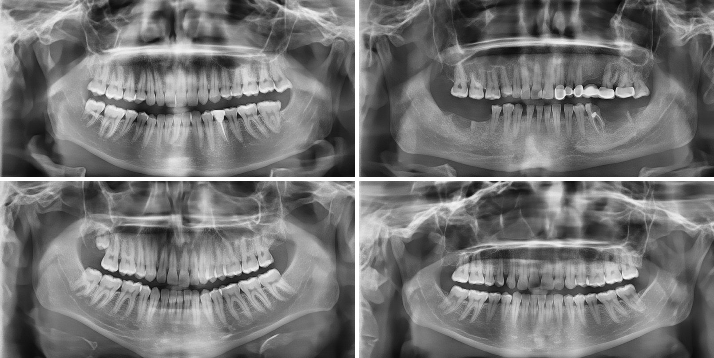

# PanoDiff-SR: Synthesizing Dental Panoramic Radiographs using Diffusion and Super-resolution

[](LICENSE)
[](https://arxiv.org/abs/2507.09227)
[](https://s4nyam.github.io/panodiff/)
[](https://www.python.org/)
[](https://pytorch.org/)

Sanyam Jain, Bruna Neves de Freitas, Andreas Basse-O'Connor, Alexandros Iosifidis, Ruben Pauwels

PanoDiff-SR generates complete dental panoramic radiographs (PRs) at 1024 × 512 in two stages:
a denoising diffusion model (**PanoDiff**) samples a 256 × 128 radiograph, and a fine-tuned hybrid
attention transformer (**HAT-SR**) upscales it fourfold in a single pass. Confining the iterative
sampler to the small grid keeps the whole pipeline trainable on one GPU.

<p align="center">
  
  <br><em>Synthetic PRs that a majority of the six dentists in our observer study judged real.</em>
</p>

## Results at a glance

Direct high-resolution synthesis against the two-stage pipeline (paper Table 11). All models were
trained on the same 7243 real PRs; FID and IS are computed against those 7243 images; precision and
recall use k = 3; "ViT det." is the accuracy of a real-versus-synthetic classifier (lower is harder to
detect); cost is in accelerator-hours on one accelerator type.

| # | Model | FID ↓ | IS ↑ | Prec. (%) ↑ | Rec. (%) ↑ | ViT det. (%) ↓ | Cost (acc.-h) |
|---|---|---|---|---|---|---|---|
| 1 | **PanoDiff-SR (ours)** | 40.50 | 2.38 | 56.2 | **28.8** | 97.6 | **82** |
| 2 | FastGAN + HAT-SR | 102.27 | 2.05 | 6.9 | 0.8 | 99.9 | 64 |
| 3 | StyleGAN2-ADA | 23.45 | 2.58 | 61.1 | 21.9 | 89.6 | 441 |
| 4 | StyleGAN3 | **19.38** | 2.66 | **67.3** | 25.5 | **77.9** | 572 |
| 5 | FastGAN-HR | 215.89 | 2.30 | 0.0 | 0.0 | 100.0 | 11 |
| 6 | ADM | 65.03 | 2.71 | 28.2 | 16.6 | 98.4 | 122 |
| 7 | LDM | 112.96 | 2.14 | 21.3 | 3.0 | 100.0 | 62 |
| 8 | PanoDiff-HR (ours, direct) | 155.41 | 2.24 | 27.5 | 1.7 | 100.0 | 120 |

- The same diffusion model trained directly at 1024 × 512 (row 8) is far worse than the two-stage
  pipeline (row 1) and costs more to train.
- The two StyleGANs reach a lower FID, at 5–7 times the training cost. Their lead is in fidelity
  (precision); PanoDiff-SR has the highest recall, i.e. it covers more of the variety of real PRs.
- Six dentists identified PanoDiff-SR images with 68.5% mean accuracy under time-limited viewing,
  against 78–82% reported for GAN-generated PRs in the literature.

The interactive [project page](https://s4nyam.github.io/panodiff/) lets you take the same
real-or-synthetic test the dentists took.

## Repository layout

```
PanoDiff/
├── data/                 corpus preparation (crop + resize of the five public datasets)
├── panodiff/             stage 1: diffusion model (training, DDIM sampling)
├── super_resolution/     stage 2: HAT-SR fine-tuning and inference; SwinIR comparison
├── baselines/            direct high-resolution baselines of Table 11 (StyleGAN2-ADA, StyleGAN3,
│                         FastGAN-HR, LDM, PanoDiff-HR, ADM patch) and the common sampler
├── evaluation/           every analysis in the paper, one folder per question
├── figures/              scripts that draw the paper's figures
├── observer_study/       the web application the dentists used, and their anonymised responses
└── docs/                 REPRODUCE.md (work-directory layout, paper result -> script map)
```

## Installation

```bash
git clone https://github.com/s4nyam/PanoDiff.git && cd PanoDiff
python -m venv .venv && source .venv/bin/activate
pip install -r requirements.txt
```

The SR stage uses [BasicSR](https://github.com/XPixelGroup/BasicSR) (installed by `requirements.txt`).
The code runs on CUDA and ROCm GPUs; the whole PanoDiff-SR pipeline trains on a single GPU.

## Quick start

**1. Prepare the corpus.** Download the five datasets listed in [`data/README.md`](data/README.md), then

```bash
python data/prepare_corpus.py --src <folder with the original radiographs> --out work/corpus
```

This writes the 1024 × 512 high-resolution images and their 256 × 128 low-resolution versions.

**2. Train PanoDiff (stage 1)** on the 256 × 128 images, as in the paper (110 epochs, batch 4):

```bash
cd panodiff
python train.py --dataset_name ../work/corpus/LR --resolution 128 --train_batch_size 4 --num_epochs 110
python generate.py --pretrained_model_path <checkpoint.pth> --samples_dir ../work/samples_lr
```

**3. Fine-tune HAT-SR (stage 2)** on 256 × 256 crops of the high-resolution corpus, then upscale:

```bash
cd super_resolution
python train.py -opt options/train_Real_HAT_GAN_SRx4_finetune_PR.yml
python test.py  -opt options/test_HAT_GAN_Real_SRx4_PR.yml
```

Each folder has its own README with the details.

**Trained weights:** PanoDiff checkpoints (epochs 11–110) at
[archive.org/download/panodiff/trained_models](https://archive.org/download/panodiff/trained_models/)
and the fine-tuned HAT-SR model at
[archive.org/download/panodiff/experiments](https://archive.org/download/panodiff/experiments/).

## Reproducing the paper

[`docs/REPRODUCE.md`](docs/REPRODUCE.md) maps every table and figure to the script that produced it
and describes the work-directory layout the evaluation scripts expect (set `PANODIFF_WORK`).
The scripts are the code that produced the published numbers, kept as they ran.

## Observer study

[`observer_study/`](observer_study) contains the Flask application used for the time-limited
real-or-synthetic test (200 images, 12 s each) and the anonymised responses of the six observers
(`submissions.csv`, observers EC1–EC3 and EP1–EP3).

## Citation

```bibtex
@article{jain2025panodiffsr,
  title   = {PanoDiff-SR: Synthesizing Dental Panoramic Radiographs using Diffusion and Super-resolution},
  author  = {Jain, Sanyam and Neves de Freitas, Bruna and Basse-O'Connor, Andreas and Iosifidis, Alexandros and Pauwels, Ruben},
  journal = {arXiv preprint arXiv:2507.09227},
  year    = {2025}
}
```

## Acknowledgements

The diffusion backbone builds on `simple_diffusion`, the SR stage on
[HAT](https://github.com/XPixelGroup/HAT) and [BasicSR](https://github.com/XPixelGroup/BasicSR),
and the ADM baseline on [guided-diffusion](https://github.com/openai/guided-diffusion).
